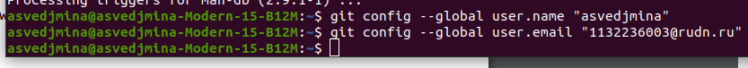
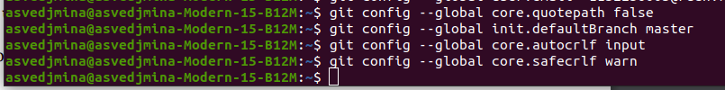
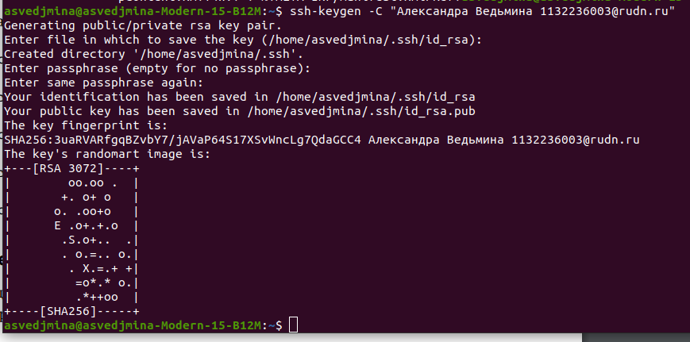
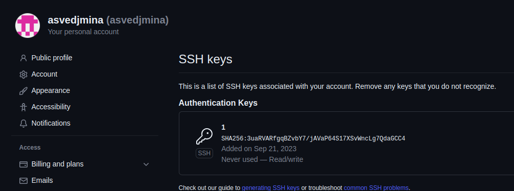
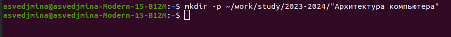
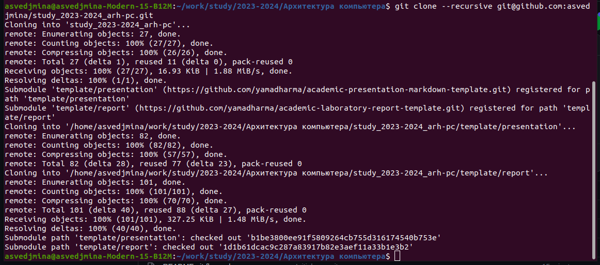
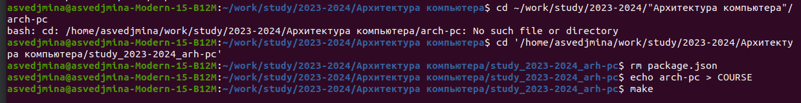
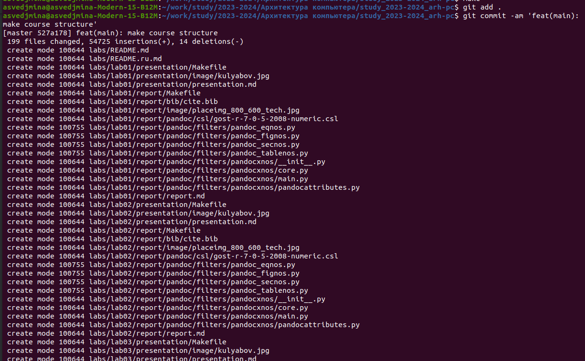
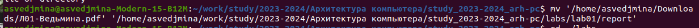

---
## Front matter
title: "Отчёт по лабораторной работе №2"
subtitle: "дисциплина: архитектура компьютеров"
author: "Ведьмина Александра Сергеевна"

## Generic otions
lang: ru-RU

## Bibliography
bibliography: bib/cite.bib
csl: pandoc/csl/gost-r-7-0-5-2008-numeric.csl

## Pdf output format
toc: true # Table of contents
toc-depth: 2
lof: true # List of figures
lot: true # List of tables
fontsize: 12pt
linestretch: 1.5
papersize: a4
documentclass: scrreprt
## I18n polyglossia
polyglossia-lang:
  name: russian
  options:
	- spelling=modern
	- babelshorthands=true
polyglossia-otherlangs:
  name: english
## I18n babel
babel-lang: russian
babel-otherlangs: english
## Fonts
mainfont: PT Serif
romanfont: PT Serif
sansfont: PT Sans
monofont: PT Mono
mainfontoptions: Ligatures=TeX
romanfontoptions: Ligatures=TeX
sansfontoptions: Ligatures=TeX,Scale=MatchLowercase
monofontoptions: Scale=MatchLowercase,Scale=0.9
## Biblatex
biblatex: true
biblio-style: "gost-numeric"
biblatexoptions:
  - parentracker=true
  - backend=biber
  - hyperref=auto
  - language=auto
  - autolang=other*
  - citestyle=gost-numeric
## Misc options
indent: true
header-includes:
  - \usepackage{indentfirst}
  - \usepackage{float} # keep figures where there are in the text
  - \floatplacement{figure}{H} # keep figures where there are in the text
---

# Цель работы

Изучить идеологию и применение средств контроля версий, научиться работать с
системой git.

# Задание

1. Зарегистрироваться на сайте github.
2. Создать репозиторий курса.
3. Изучить основные команды git.
4. Выполнить задания для самостоятельной работы.
5. Создать отчёт по выполнению лабораторной работы.

# Теоретическое введение

Системы контроля версий нужны для работы нескольких человек над одним проектом.
Основное дерево проекта хранится в локальном или удалённом репозитории.
Участники проекта имеют к нему доступ и могут видеть изменения, вносимые каждым
из участников в содержимое проекта. Можно делать откат к любой более ранней
версии проекта.
В классических системах контроля версий используется централизованная модель
(единый репозиторий для хранения файлов). Большинство функций выполняет
специальный сервер. Перед началом работы пользователь получает нужную ему
версию файлов и может разместить новую версию в хранилище, имея возможность
вернуться к предыдущим версиям в любой момент.
Более того, системы контроля версий способны поддерживать работу с несколькими
версиями одного файла, сохраняя общую историю изменений до точки ветвления
версий и собственные истории изменений каждой ветви. Кроме того, обычно доступна
информация о том, кто из участников, когда и какие изменения вносил.

Система контроля версий Git - это набор программ командной строки, доступ к
которым можно получить через терминал с помощью команды git и её опций.

git init - создание основного дерева репозитория git pull получение обновлений
(изменений) текущего дерева из центрального репозитория
git push - отправка всех произведённых изменений локального дерева в центральный
репозиторий
git status - просмотр списка изменённых файлов в текущей директории
git diff - просмотр текущих изменения
git add . - добавить все изменённые и/или созданные файлы и/или каталоги
git add - имена_файлов добавить конкретные изменённые и/или созданные файлы и/или
каталоги
git rm - имена_файлов удалить файл и/или каталог из индекса репозитория (при этом
файл и/или каталог остаётся в локальной директории)
git commit -am - сохранить все добавленные изменения и все изменённые файлы
git checkout -b - создание новой ветки, базирующейся на текущей
git checkout - переключение на некоторую ветку (при переключении на ветку, которой
ещё нет в локальном репозитории, она будет создана и связана с удалённой)
git push origin - отправка изменений конкретной ветки в центральный репозиторий
git merge --no-ff - слияние ветки с текущим деревом
git branch -d - удаление локальной уже слитой с основным деревом ветки
git branch -D - принудительное удаление локальной ветки
git push origin - удаление ветки с центрального репозитория

Работать со своей веткой следует начинать с проверки и получения изменений из
центрального репозитория. Это можно осуществить с помощью команд git checkout
master, git pull, git checkout -b <имя_ветки>. После этого можно вносить изменения в
локальном дереве. Если нужно сохранить все изменения в текущем каталоге, то
используем git add . Отправляем в центральный репозиторий с помощью команды git
push origin <имя_ветки> или git push.

# Выполнение лабораторной работы

Создаю учётную запись на сайте https://github.com/ , после чего делаю
предварительную конфигурацию git.

{#fig:001 width=100%}

Настраиваю utf-8 в выводе сообщений git, задаю имя master для начальной ветки,
параметр autocrlf и safecrlf.

{#fig:002 width=100%}

Генерирую SSH-ключ.

{#fig:003 width=100%}

Загружаю сгенерённый открытый ключ, зайдя на сайт http: //github.org/ под своей
учётной записью и скопировав из локальной консоли ключ в буфер обмена.

{#fig:004 width=100%}

В терминале и создаю каталог для предмета «Архитектура компьютера» согласно
указанному в инструкции шаблону.

{#fig:005 width=100%}

Для создания репозитория использую web-интерфейс github. Перехожу на страницу
репозитория с шаблоном курса https://github.com/yamadharma/cour
se-directory-student-template и выбираю “use this template”, называю репозиторий
study_2023-2024_arh-pc.

В терминале перехожу в каталог курса и клонирую созданный репозиторий.

{#fig:006 width=100%}

Перехожу в каталог курса, удаляю лишние файлы и создаю необходимые каталоги.

{#fig:007 width=100%}

Затем отправляю файлы на сервер.

{#fig:008 width=100%}

# Задания для самостоятельной работы

1. Создайте отчет по выполнению лабораторной работы в соответствующем каталоге
рабочего пространства (labs>lab02>report).
2. Скопируйте отчеты по выполнению предыдущих лабораторных работ в
соответствующие каталоги созданного рабочего пространства.

Выполнение:

Перемещаю отчёт по первой лабораторной работе в ~/lab01/report.

{#fig:009 width=100%}

Далее загружаю файлы на гитхаб.

# Выводы

В ходе лабораторной работы я изучали, как работают средства контроля версий,
система git.
