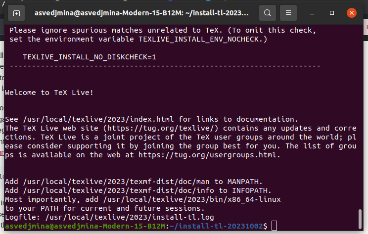
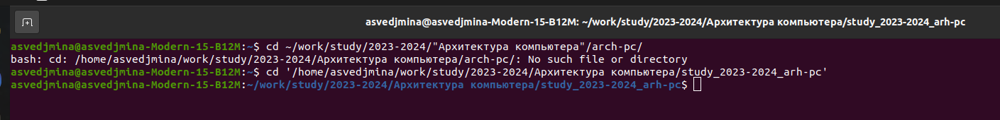
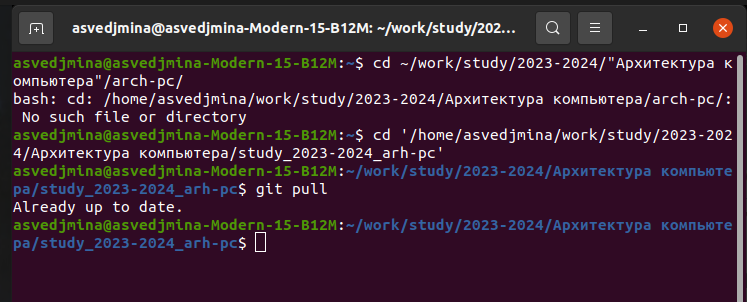
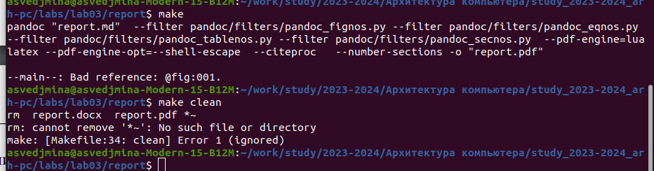
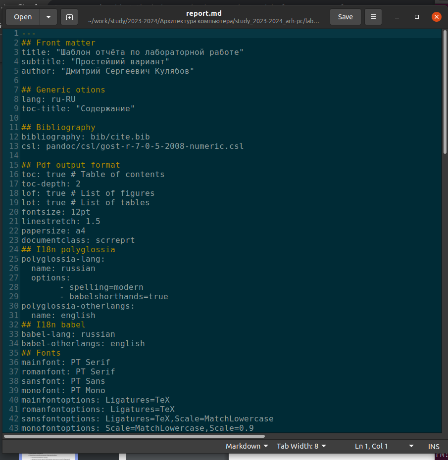

---
## Front matter
title: "Лабораторная работа №3. Язык разметки markdown"
subtitle: "по архитектуре компьютеров"
author: "Александра Сергеевна Ведьмина"

## Generic otions
lang: ru-RU
toc-title: "Содержание"

## Bibliography
bibliography: bib/cite.bib
csl: pandoc/csl/gost-r-7-0-5-2008-numeric.csl

## Pdf output format
toc: true # Table of contents
toc-depth: 2
lof: true # List of figures
lot: true # List of tables
fontsize: 12pt
linestretch: 1.5
papersize: a4
documentclass: scrreprt
## I18n polyglossia
polyglossia-lang:
  name: russian
  options:
	- spelling=modern
	- babelshorthands=true
polyglossia-otherlangs:
  name: english
## I18n babel
babel-lang: russian
babel-otherlangs: english
## Fonts
mainfont: PT Serif
romanfont: PT Serif
sansfont: PT Sans
monofont: PT Mono
mainfontoptions: Ligatures=TeX
romanfontoptions: Ligatures=TeX
sansfontoptions: Ligatures=TeX,Scale=MatchLowercase
monofontoptions: Scale=MatchLowercase,Scale=0.9
## Biblatex
biblatex: true
biblio-style: "gost-numeric"
biblatexoptions:
  - parentracker=true
  - backend=biber
  - hyperref=auto
  - language=auto
  - autolang=other*
  - citestyle=gost-numeric
## Misc options
indent: true
header-includes:
  - \usepackage{indentfirst}
  - \usepackage{float} # keep figures where there are in the text
  - \floatplacement{figure}{H} # keep figures where there are in the text
---

# Цель работы

Целью работы является освоение процедуры оформления отчетов с помощью легковесного
языка разметки Markdown.

# Задание

1. Установка необходимого ПО.
2. Заполнение отчёта по лабораторной работе.
3. Загрузка файлов на гитхаб.
4. Задания для самостоятельной работы.

# Теоретическое введение

Markdown — это облегченный язык разметки с синтаксисом форматирования обычного текста. В нём используются такеи символы, как * , # , _ и так далее.

# Выполнение лабораторной работы

 Устанавливаю TexLive.
 
 {#fig:001 width=100%}
 
 Перехожу в каталог курса и обновляю локальный репозиторий.
 
 {#fig:002 width=100%}
 
 {#fig:003 width=100%}
 
 С помощью команды make генерирую файлы report.pdf и report.docx, проверяю корректность выполненных действий и удаляю полученные файлы, используя make clean.
 
 {#fig:004 width=100%}
 
 Открываю файл report.md в gedit и заполняю отчёт по лабораторной работе.
 
{#fig:005 width=100%}

В качестве задания для самостоятельной работы заполняю отчёт по второй лабораторной работе в формате markdown. Загружаю все файлы на github.

Ссылка на репозиторий гитхаб: https://github.com/asvedjmina/study_2023-2024_arh-pc

# Выводы

В ходе выполнения лабораторной работы я научилась оформлять отчёты с помощью языка разметки markdown.
