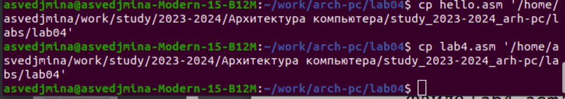

---
## Front matter
title: "Отчёт по лабораторной работе №4"
subtitle: "Создание и процесс обработки программ на языке ассемблера NASM"
author: "Александра Сергеевна Ведьмина"

## Generic otions
lang: ru-RU
toc-title: "Содержание"

## Bibliography
bibliography: bib/cite.bib
csl: pandoc/csl/gost-r-7-0-5-2008-numeric.csl

## Pdf output format
toc: true # Table of contents
toc-depth: 2
lof: true # List of figures
lot: true # List of tables
fontsize: 12pt
linestretch: 1.5
papersize: a4
documentclass: scrreprt
## I18n polyglossia
polyglossia-lang:
  name: russian
  options:
	- spelling=modern
	- babelshorthands=true
polyglossia-otherlangs:
  name: english
## I18n babel
babel-lang: russian
babel-otherlangs: english
## Fonts
mainfont: PT Serif
romanfont: PT Serif
sansfont: PT Sans
monofont: PT Mono
mainfontoptions: Ligatures=TeX
romanfontoptions: Ligatures=TeX
sansfontoptions: Ligatures=TeX,Scale=MatchLowercase
monofontoptions: Scale=MatchLowercase,Scale=0.9
## Biblatex
biblatex: true
biblio-style: "gost-numeric"
biblatexoptions:
  - parentracker=true
  - backend=biber
  - hyperref=auto
  - language=auto
  - autolang=other*
  - citestyle=gost-numeric
## Pandoc-crossref LaTeX customization
figureTitle: "Рис."
tableTitle: "Таблица"
listingTitle: "Листинг"
lofTitle: "Список иллюстраций"
lotTitle: "Список таблиц"
lolTitle: "Листинги"
## Misc options
indent: true
header-includes:
  - \usepackage{indentfirst}
  - \usepackage{float} # keep figures where there are in the text
  - \floatplacement{figure}{H} # keep figures where there are in the text
---

# Цель работы

Освоение процедуры компиляции и сборки программ, написанных на ассемблере NASM.

# Задание

1. Создать файл с программой Hello World!
2. Воспользоваться транслятором NASM.
3. Передать файл на обработку компоновщику.
4. Запустить исполняемый файл.
5. Выполнить задания для самостоятельной работы.

# Теоретическое введение

Язык ассемблера (asm) — машинно-ориентированный язык низкого уровня. Он позволяет получить более полный доступ к архитектуре ЭВМ и её аппаратным возможностям. Программы, написанные на языке asm, обращаются напрямую к ядру ОС. При этом процессор понимает не команды ассемблера, а последовательности из нулей и единиц — машинные коды.

В процессе создания ассемблерной программы можно выделить четыре шага:

1. Набор текста.
2. Трансляция.
3. Компановка или линовка.
4. Запуск программы.

# Выполнение лабораторной работы

Создаю каталог для работы с программами на языке ассемблера NASM, перехожу в него и создаю текстовый файл с именем hello.asm . 

{#fig:001 width=100%}

Открываю этот файл с помощью редактора gedit и ввожу в него требуемый текст, после чего провожу компиляцию текста программы.

{#fig:002 width=100%}

Компилирую исходный файл в obj.o, проверяю корректность выполненных действий с помощью команды ls.

{#fig:003 width=100%}

Передаю объектный файл на обработку компоновщику.

{#fig:004 width=100%}

Создаю исполняемый файл с именем main.

{#fig:005 width=100%}

Запускаю на выполнение созданный исполняемый файл.

{#fig:006 width=100%}

# Выполнение заданий для самостоятельной работы

Создаю копию файла hello.asm с именем lab4.asm.

{#fig:007 width=100%}

Изменяю текст программы в файле lab4.asm так, чтобы на экран выводились мои имя и фамилия (Александра Ведьмина).

{#fig:008 width=100%}

Транслирую полученный текст программы lab4.asm в объектный файл.

{#fig:009 width=100%}

Выполняю компоновку объектного файла и запустите получившийся исполняемый файл.

{#fig:010 width=100%}

Копирую файлы hello.asm и lab4.asm в мой локальный репозиторий в каталог ~/work/study/2023-2024/"Архитектура компьютера"/arch-pc/labs/lab04/.

{#fig:011 width=100%}

Загружаю файлы на гитхаб.

{#fig:012 width=100%}

Ссылка на резозиторий гитхаб: https://github.com/asvedjmina/study_2023-2024_arh-pc

# Выводы

В ходе лабораторной работы я изучила процедуру компиляции и сборки программ, написанных на языке NASM.
