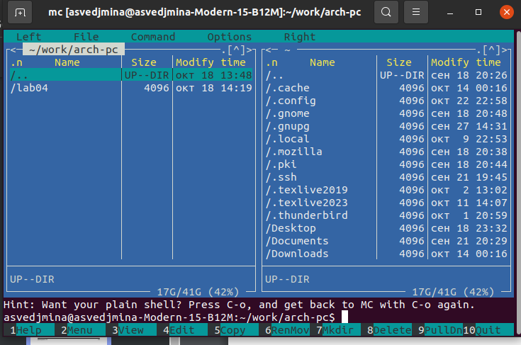

---
## Front matter
title: "Отчёт по лабораторной работе №5"
subtitle: "Основы работы с Midnight commander. Структура программы на языке NASM. Системные вызовы"
author: "Ведьмина Александра Сергеевна"

## Generic otions
lang: ru-RU
toc-title: "Содержание"

## Bibliography
bibliography: bib/cite.bib
csl: pandoc/csl/gost-r-7-0-5-2008-numeric.csl

## Pdf output format
toc: true # Table of contents
toc-depth: 2
lof: true # List of figures
lot: true # List of tables
fontsize: 12pt
linestretch: 1.5
papersize: a4
documentclass: scrreprt
## I18n polyglossia
polyglossia-lang:
  name: russian
  options:
	- spelling=modern
	- babelshorthands=true
polyglossia-otherlangs:
  name: english
## I18n babel
babel-lang: russian
babel-otherlangs: english
## Fonts
mainfont: PT Serif
romanfont: PT Serif
sansfont: PT Sans
monofont: PT Mono
mainfontoptions: Ligatures=TeX
romanfontoptions: Ligatures=TeX
sansfontoptions: Ligatures=TeX,Scale=MatchLowercase
monofontoptions: Scale=MatchLowercase,Scale=0.9
## Biblatex
biblatex: true
biblio-style: "gost-numeric"
biblatexoptions:
  - parentracker=true
  - backend=biber
  - hyperref=auto
  - language=auto
  - autolang=other*
  - citestyle=gost-numeric
## Pandoc-crossref LaTeX customization
figureTitle: "Рис."
tableTitle: "Таблица"
listingTitle: "Листинг"
lofTitle: "Список иллюстраций"
lotTitle: "Список таблиц"
lolTitle: "Листинги"
## Misc options
indent: true
header-includes:
  - \usepackage{indentfirst}
  - \usepackage{float} # keep figures where there are in the text
  - \floatplacement{figure}{H} # keep figures where there are in the text
---

# Цель работы

Приобретение практических навыков работы в Midnight Commander. Освоение инструкций
языка ассемблера mov и int.

# Задание

1. Изучить основы работы с mc.
2. Познакомиться со структурой программы вывода сообщений на экран и ввода со строки на языке NASM.
3. Подключить файл in_out.asm.
4. Выполнить задания для самостоятельной работы.

# Теоретическое введение

Midnight Commander — это файловый менеджер, с помощью которого можно просматривать
структуру каталогов и выполнять основные операции по управлению файловой системой. Чтобы начать использовать Midnight Commander, достаточно ввести в командной строке mc.
Программа на языке ассемблера NASM обычно состоит из трёх секций: секция кода, секция инициированных данных и секция неинициализированных данных. Для объявления инициированных данных в секции .data используются директивы DB, DW, DD, DQ и DT, которые резервируют память и указывают, какие значения должны храниться в этой памяти. Директивы применяются для объявления простых переменных и для объявления массивов. Для определения строк принято использовать директиву DB. Для объявления неинициированных данных в секции .bss используются директивы resb, resw, resd и другие. В качестве операндов могут выступать регистры, ячейки памяти и значения.

Простейший способ вывести строку на экран — использовать системный вызов write. Этот системный вызов имеет номер 4, поэтому перед вызовом инструкции int необходимо поместить значение 4 в регистр eax. Первым аргументом write, помещаемым в регистр ebx, задаётся дескриптор файла. Для ввода строки с клавиатуры можно использовать аналогичный системный вызов read. Его аргументы –такие же, как у вызова write,только для «чтения» с клавиатуры используется файловый дескриптор 0.

# Выполнение лабораторной работы

Открываю Midnight Commander.

{#fig:001 width=100%}

Перехожу в каталог, созданный  при выполнении лабораторной №4.

{#fig:002 width=100%}

Создаю папку lab05  и перехожу в созданный каталог.

{#fig:003 width=100%}

Создаю файл lab5-1.asm.

{#fig:004 width=100%}

Открываю этот файл в редакторе nano и ввожу предагаемый текст программы, после чего закрываю файл.

{#fig:005 width=100%}

Транслирую lab5-1.asm в объектный файл, выполняю его компановку и запускаю исполняемый файл. На запрос ввожу своё ФИО (Ведьмина Александра Сергеевна).

{#fig:006 width=100%}

{#fig:007 width=100%}

Далее скачиваю файл in_out.asm с ТУИСа и помещаю его в ~/work/arch-pc/lab05.

{#fig:008 width=100%}

Делаю копию файла lab5-1.asm и называю её lab5-2.asm.

{#fig:009 width=100%}

Используя подпрограммы из in_out.asm, вношу изменения в lab5-2.asm.

{#fig:010 width=100%}

Создаю исполняемый файл и запускаю его.

{#fig:011 width=100%}

В файле lab5-2.asm заменяю sprintLF на sprint, создаю исполняемый файл lab5-2-1 и запускаю его, после чего переименовываю его в lab5-2.

{#fig:012 width=100%}

Разница между программами со sprintLF и sprint состоит в том, что просит ввести данные на той же строке, на которой выводится их запрос, в то время как вторая предлагает сделать это на новой строке.

# Выполнение заданий для самостоятельной работы

Создаю копию файла lab5-1.asm с именем lab5-1-copy.asm и вношу изменения в программу так, чтобы она выводила введённую строку на экран.

{#fig:013 width=100%}

Получаю исполняемый файл и запускаю его, вводя на запрос своё ФИО.

{#fig:014 width=100%}

Создаю копию файла lab-2.asm с именем lab5-2-copy.asm, изменяю программу так, чтобы она тоже выводила на экран введённую строку.

{#fig:015 width=100%}

После этого создаю исполняемый файл и запускаю его.

{#fig:016 width=100%}

# Выводы

В ходе этой лабораторной работы я научилась в Midnight Commander и освоила инструкции языка ассемблера mov и int.
