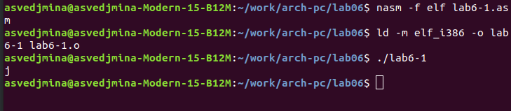

---
## Front matter
title: "Отчёт по лабораторной работе №6"
subtitle: "дисциплина: архитектура компьютеров"
author: "Ведьмина Александра Сергеевна"

## Generic otions
lang: ru-RU
toc-title: "Содержание"

## Pdf output format
toc: true # Table of contents
toc-depth: 2
lof: true # List of figures
lot: true # List of tables
fontsize: 12pt
linestretch: 1.5
papersize: a4
documentclass: scrreprt
## I18n polyglossia
polyglossia-lang:
  name: russian
  options:
	- spelling=modern
	- babelshorthands=true
polyglossia-otherlangs:
  name: english
## I18n babel
babel-lang: russian
babel-otherlangs: english
## Fonts
mainfont: PT Serif
romanfont: PT Serif
sansfont: PT Sans
monofont: PT Mono
mainfontoptions: Ligatures=TeX
romanfontoptions: Ligatures=TeX
sansfontoptions: Ligatures=TeX,Scale=MatchLowercase
monofontoptions: Scale=MatchLowercase,Scale=0.9
## Biblatex
biblatex: true
biblio-style: "gost-numeric"
biblatexoptions:
  - parentracker=true
  - backend=biber
  - hyperref=auto
  - language=auto
  - autolang=other*
  - citestyle=gost-numeric
## Pandoc-crossref LaTeX customization
figureTitle: "Рис."
tableTitle: "Таблица"
listingTitle: "Листинг"
lofTitle: "Список иллюстраций"
lotTitle: "Список таблиц"
lolTitle: "Листинги"
## Misc options
indent: true
header-includes:
  - \usepackage{indentfirst}
  - \usepackage{float} # keep figures where there are in the text
  - \floatplacement{figure}{H} # keep figures where there are in the text
---

# Цель работы

Освоение арифметических инструкций языка ассемблера NASM.

# Задание

1. Ознакомиться с теорией
2. Изучить простые арифметические операции NASM.
3. Выполнить задания для самостоятельной работы.

# Теоретическое введение

Большинство инструкций на языке ассемблера требуют обработки операндов. Адрес операнда - это место, где хранятся данные.

Способы адресации:
1. Регистровая
2. Непосредственная
3. Адресация памяти

Команда целочисленного сложения add (от англ. addition - добавление) выполняет
сложение двух операндов и записывает результат по адресу первого операнда.
sub отвечает за вычитание.

Для команд умножения один из сомножителей указывается в команде и должен находиться в регистре или в памяти, но не может быть непосредственным операндом. Второй
сомножитель в команде явно не указывается и должен находиться в регистре EAX,AX или
AL, а результат помещается в регистры EDX:EAX, DX:AX или AX, в зависимости от размера
операнда.

Ввод информации с клавиатуры и вывод её на экран осуществляется в символьном виде.
Кодирование этой информации производится согласно кодовой таблице символов ASCII.
ASCII – сокращение от American Standard Code for Information Interchange (Американский
стандартный код для обмена информацией). Согласно стандарту ASCII каждый символ
кодируется одним байтом.

# Выполнение лабораторной работы

Создаю каталог lab6, перехожу в него и создаю файл lab6-1.asm.

{#fig:001 width=100%}

Ввожу в данный файл текст требуемой программы.

{#fig:002 width=100%}

Создаю исполняемый файл и запускаю его.

{#fig:003 width=100%}

Затем в тексте программы заменяю строки mov eax,'6', mov ebx,'4' на строки mov eax,6,mov ebx,4.

{#fig:004 width=100%}

Создаю исполняемый файл и запускаю его.

{#fig:005 width=100%}

Символ, полученный в результате программы, не отображается. По таблице ASCII коду 10 соответствует символ, изображающий круг в квадрате.

Создаю файл lab6-2.asm и ввожу в него предложенный текст проограммы.

{#fig:006 width=100%}

{#fig:007 width=100%}

Создаю исполняемый файл и запускаю его.

{#fig:008 width=100%}

Заменяю mov eax,'6' и mov ebx,'4' на mov eax,6 и mov ebx,4 в файле lab6-2.asm.

{#fig:009 width=100%}

Создаю исполняемый файл и запускаю его.

{#fig:010 width=100%}

При исполнении программы получен результат 10. Заменяю функцию iprintLF на iprint в файле lab6-2.asm, затем создаю исполняемый файл и запускаю его.

{#fig:011 width=100%}

Функция iprint в отличие от iprintLF предлагает нам ввести следующую команду на той же строке, на которой был выведен результат выполнения программы.

Далее создаю файл lab6-3.asm и ввожу программу вычисления выражения f(x)=(5*2+3)/3.

{#fig:012 width=100%}

Создаю исполняемый файл и запускаю его.

{#fig:013 width=100%}

Изменяю текст программы так, чтобы она вычисляла выражение f(x)=(4*6+2)/5.

{#fig:014 width=100%}

Создаю исполняемый файл и проверяю его работу.

{#fig:015 width=100%}

Создаю файл variant.asm.

{#fig:016 width=100%}

Ввожу в данный файл программу для вычисления варианта задания.

{#fig:017 width=100%}

Создаю исполняемый файл и запускаю его.

{#fig:018 width=100%}

Ответы на вопросы по листингу 6.4:

1. За вывод на экран сообщения "Ваш вариант:" в листинге 6.4 отвечают строки mov eax,rem и call sprint.
2. mov ecx,x прокладывает адрес введённой строки в ecx; mov edx,80 обозначает запись в регистр edx; call sread используется для вызова подпрограммы, которая считывает текст с клавиатуры.
3. call atoi нужна для вызова подпрограммы, которая преобразовывает код символа из таблицы ASCII в сам символ и записыывает его в eax.
4. За вычисление варианта отвечают строки xor edx, edx; mov ebx,20; div ebx; inc edx.
5. Остаток от деления от div ebx записывается в edx.
6. inc edx увеличивает значение регистра на один.
7. За вывод на экран результата вычислений отвечают mov eax, edx и call iprintLF.

# Выполнение заданий для самостоятельной работы

Номер моего варианта - 4, поэтому я буду реализовывать функцию f(x) = 4/3(x-1)+5. Для выполнения задания создаю файл sumrub.asm и записываю в него необходимую программу.

{#fig:019 width=100%}

Создаю исполняемый файл и запускаю программу.

{#fig:020 width=100%}

{#fig:021 width=100%}

# Выводы

В ходе выполнения лабораторной работы я освоила арифметические операции в NASM.
