---
## Front matter
title: "Отчёт по лабораторной работе №7"
subtitle: "дисциплина: архитектура компьютеров"
author: "Ведьмина Александра Сергеевна"

## Generic otions
lang: ru-RU
toc-title: "Содержание"

## Bibliography
bibliography: bib/cite.bib
csl: pandoc/csl/gost-r-7-0-5-2008-numeric.csl

## Pdf output format
toc: true # Table of contents
toc-depth: 2
lof: true # List of figures
lot: true # List of tables
fontsize: 12pt
linestretch: 1.5
papersize: a4
documentclass: scrreprt
## I18n polyglossia
polyglossia-lang:
  name: russian
  options:
	- spelling=modern
	- babelshorthands=true
polyglossia-otherlangs:
  name: english
## I18n babel
babel-lang: russian
babel-otherlangs: english
## Fonts
mainfont: PT Serif
romanfont: PT Serif
sansfont: PT Sans
monofont: PT Mono
mainfontoptions: Ligatures=TeX
romanfontoptions: Ligatures=TeX
sansfontoptions: Ligatures=TeX,Scale=MatchLowercase
monofontoptions: Scale=MatchLowercase,Scale=0.9
## Biblatex
biblatex: true
biblio-style: "gost-numeric"
biblatexoptions:
  - parentracker=true
  - backend=biber
  - hyperref=auto
  - language=auto
  - autolang=other*
  - citestyle=gost-numeric
## Pandoc-crossref LaTeX customization
figureTitle: "Рис."
tableTitle: "Таблица"
listingTitle: "Листинг"
lofTitle: "Список иллюстраций"
lotTitle: "Список таблиц"
lolTitle: "Листинги"
## Misc options
indent: true
header-includes:
  - \usepackage{indentfirst}
  - \usepackage{float} # keep figures where there are in the text
  - \floatplacement{figure}{H} # keep figures where there are in the text
---

# Цель работы

Изучение команд условного и безусловного переходов. Приобретение навыков написания
программ с использованием переходов. Знакомство с назначением и структурой файла
листинга.

# Задание

1. Ознакомиться с командами условного и безусловного перехода
2. Изучить структуру файла листинга
3. Рассмотреть программы, использующие разные переходы в nasm
4. Выполнить задания для самостоятельной работы

# Теоретическое введение

Безусловный переход выполняется инструкцией jmp. Адрес перехода может быть либо меткой, либо адресом области памяти, в которую предварительно помещен указатель перехода. Для условных переходов задаются условия: например, мнемокод JE обозначает a=b, значение флага ZF=1 и осуществляет переход, если операнды равны.

Листинг - это один из выходных файлов, создаваемых транслятором. Он имеет текстовый вид и нужен при отладке программы. В его структуру входят номер строки (это номер строки файла листинга), адрес (смещение машинного кода от начала текущего сегмента), машинный код (ассемблированная исходная строка в виде шестнадцатеричной последовательности), исходный текст программы (строка исходной программы вместе с комментариями).

# Выполнение лабораторной работы

Создаю каталог lab07 и файл lab7-1.asm в нём.

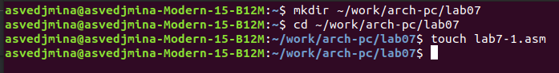{#fig:001 width=100%}

Ввожу в файл lab7-1.asm программу, использующую инструкцию jmp.

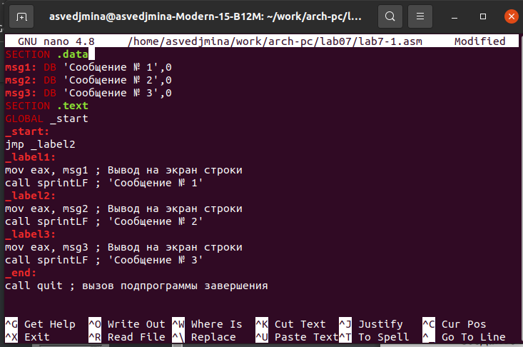{#fig:002 width=100%}

Создаю исполняемый файл и запускаю его.

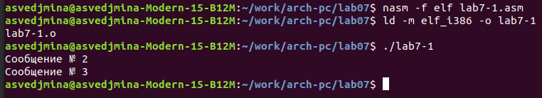{#fig:003 width=100%}

Изменяю программу так, чтобы выводилось сообщение 2, а потом сообщение 1.

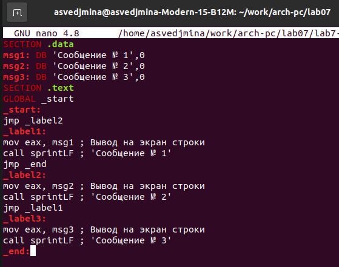{#fig:004 width=100%}

Создаю исполняемый файл и запускаю его.

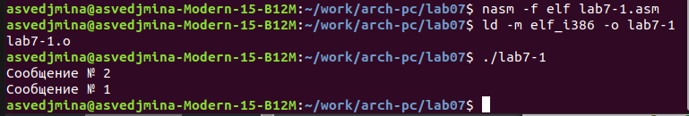{#fig:005 width=100%}

Снова изменяю текст программы таким образом, что выводилось сначала сообщение 3, затем сообщение 2 и сообщение 1.

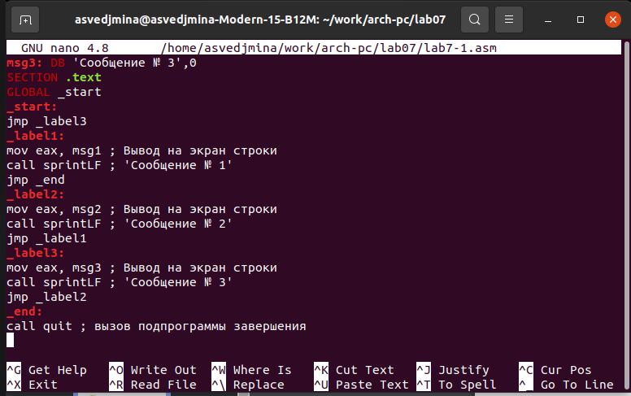{#fig:006 width=100%}

Создаю исполняемый файл и проверяю его работу.

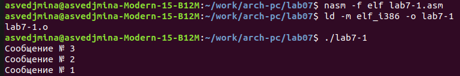{#fig:007 width=100%}

Создаю файл lab7-2.asm и ввожу в него текст программы, которая определяет и выводит на экран наибольшую из переменных A, B, C.

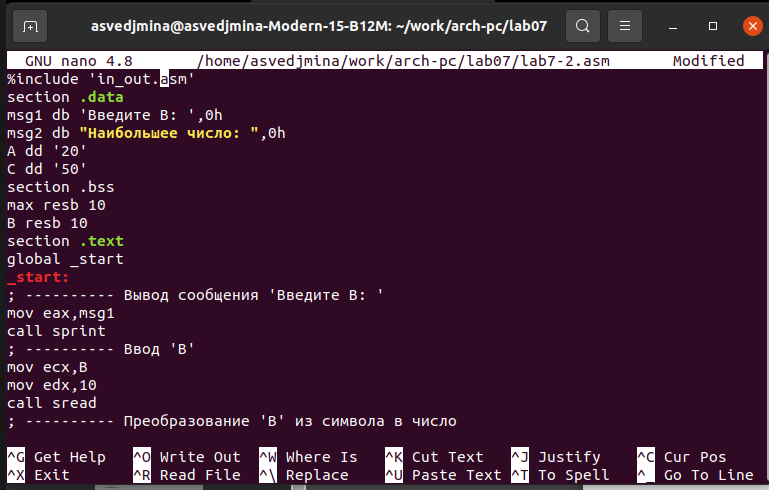{#fig:008 width=100%}

Создаю исполняемый файл и запускаю его, проверяю его работу при разных значениях В.

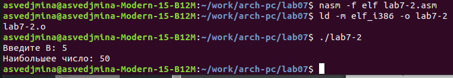{#fig:009 width=100%}

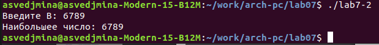{#fig:010 width=100%}

Создаю файл листинга для программы из файла lab7-2.asm.

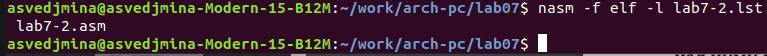{#fig:011 width=100%}

Открываю файл lab7-2.lst  с помощью mcedit и изучаю содержимое.

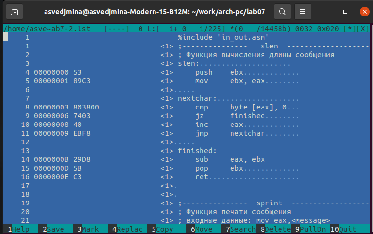{#fig:012 width=100%}

Cтрока lab7-2.lst 224:
1. 47 - номер строки в программе
2. 0000015Е - адрес
3. А1[0000000] - машинный код
4. mov eax, [max] - перемещение максимального значения среди переменных в eax

Cтрока lab7-2.lst 225:
1. 48 - номер строки в программе
2. 00000163 - адрес
3. Е81ЕFFFFFF - машинный код
4. call iprintLF - вывод переменной с наибольшим значением

Cтрока lab7-2.lst 226:
1. 49 - номер строки в программе
2. 00000168 - адрес
3. Е86ЕFFFFFF - машинный код
4. call quit - выход из программы

В файле с программой lab7-2.asm в инструкции с двумя операндами удаляю один операнд, после чего выполняю трансляцию с получением файла листинга. Открываю полученный файл и вижу, что звёздочками там отображается место, где в коде программы допущена ошибка и приводится её пояснение.

{#fig:013 width=100%}

# Выполнение заданий для самостоятельной работы

1. Создаю файл sunrub-1.asm и ввожу в него текст программы нахождения наименьшей из 3 целочисленных переменных. Мой вариант, полученный в предыдущей лабораторной - 4, поэтому я буду использовать следующие значения переменных: a = 8, b = 88, c = 68.

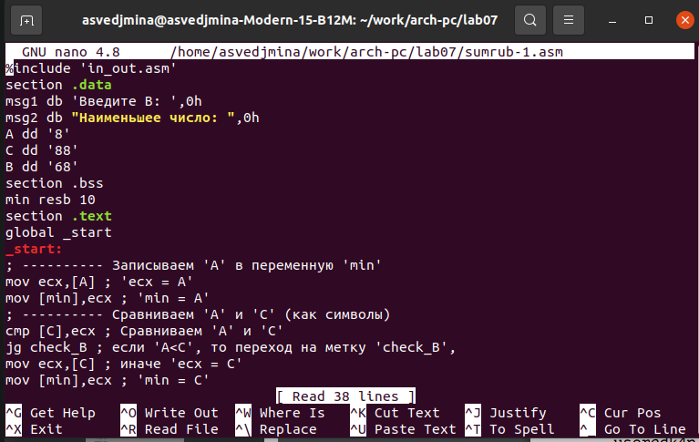{#fig:014 width=100%}

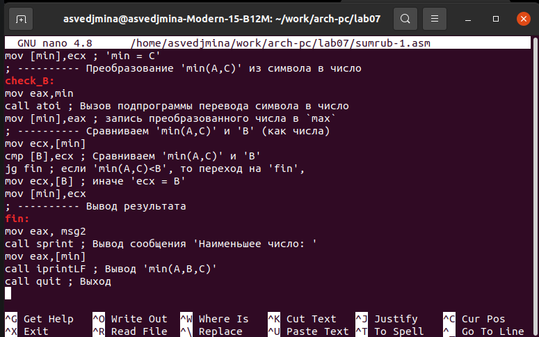{#fig:015 width=100%}

Создаю исполняемый файл и проверяю его работу.

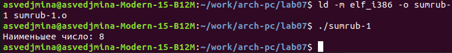{#fig:016 width=100%}

2. Создаю файл sumrub-2.asm и ввожу в него программу, которая для введенных с клавиатуры значений х и а вычисляет значение заданной функции. Я буду реализовывать функцию вида 2x+a при а, не равном нулю, и 2х+1 при а, равном нулю.

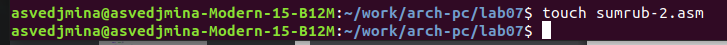{#fig:017 width=100%}

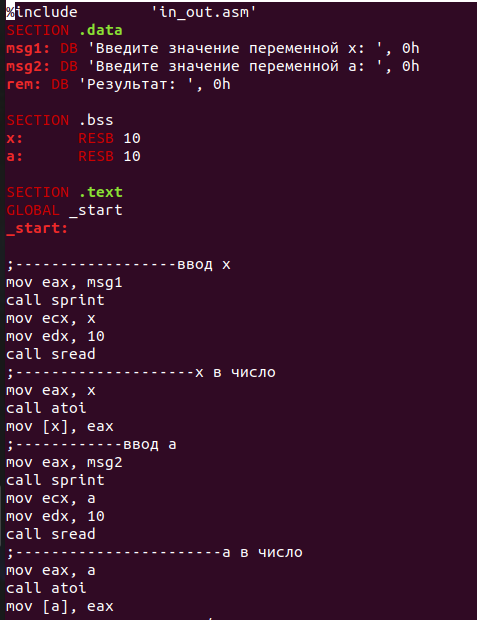{#fig:018 width=100%}

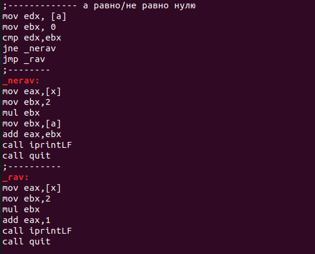{#fig:019 width=100%}

Создаю исполняемый файл и проверяю его работу для значений х и а, указанных в задании.

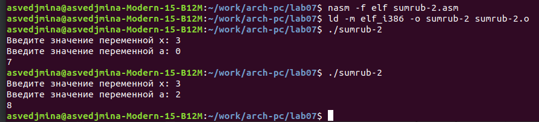{#fig:020 width=100%}

# Выводы

В ходе лабораторной работы я изучила команды условного и безусловного перехода, освоила написание программ с использованием переходов, а также познакомилась со структурой файла листинга.
