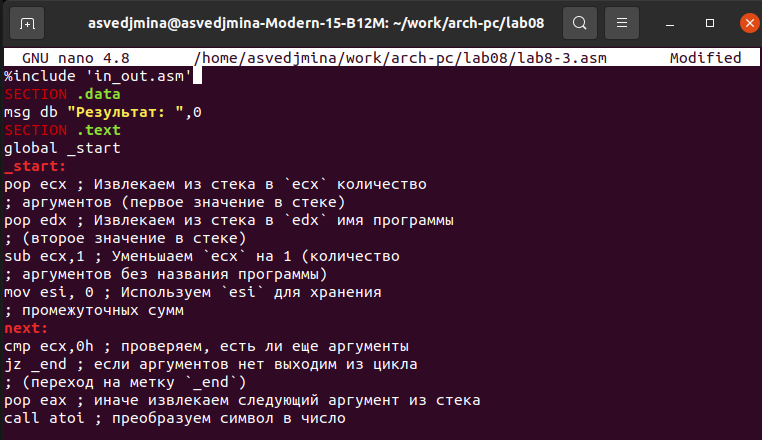
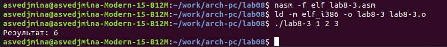

---
## Front matter
title: "Отчёт по лабораторной работе №8"
subtitle: "дисциплина: Архитектура компьютеров"
author: "Ведьмина Александра Сереевна"

## Generic otions
lang: ru-RU
toc-title: "Содержание"

## Bibliography
bibliography: bib/cite.bib
csl: pandoc/csl/gost-r-7-0-5-2008-numeric.csl

## Pdf output format
toc: true # Table of contents
toc-depth: 2
lof: true # List of figures
lot: true # List of tables
fontsize: 12pt
linestretch: 1.5
papersize: a4
documentclass: scrreprt
## I18n polyglossia
polyglossia-lang:
  name: russian
  options:
	- spelling=modern
	- babelshorthands=true
polyglossia-otherlangs:
  name: english
## I18n babel
babel-lang: russian
babel-otherlangs: english
## Fonts
mainfont: PT Serif
romanfont: PT Serif
sansfont: PT Sans
monofont: PT Mono
mainfontoptions: Ligatures=TeX
romanfontoptions: Ligatures=TeX
sansfontoptions: Ligatures=TeX,Scale=MatchLowercase
monofontoptions: Scale=MatchLowercase,Scale=0.9
## Biblatex
biblatex: true
biblio-style: "gost-numeric"
biblatexoptions:
  - parentracker=true
  - backend=biber
  - hyperref=auto
  - language=auto
  - autolang=other*
  - citestyle=gost-numeric
## Pandoc-crossref LaTeX customization
figureTitle: "Рис."
tableTitle: "Таблица"
listingTitle: "Листинг"
lofTitle: "Список иллюстраций"
lotTitle: "Список таблиц"
lolTitle: "Листинги"
## Misc options
indent: true
header-includes:
  - \usepackage{indentfirst}
  - \usepackage{float} # keep figures where there are in the text
  - \floatplacement{figure}{H} # keep figures where there are in the text
---

# Цель работы

Приобретение навыков написания программ с использованием циклов и обработкой
аргументов командной строки.

# Задание

1. Изучить теорию по организации стека
2. Ознакомиться с реализацией циклов в NASM
3. Выполнить задание для самостоятельной работы

# Теоретическое введение

Стек — это структура данных, организованная по принципу LIFO. Его основная функция - сохранение адресов возврата и передачи аргументов при вызове процедур. Кроме того, в нём выделяется память для локальных переменных и могут временно храниться значения регистров. Вершина стека - адрес последнего добавленного элемента, противоположный конец стека именуется дном.
В работе со стеками есть две основные операции: добавление элемента в вершину, извлечение элемента из вершины.

# Выполнение лабораторной работы

Создаю каталог lab08, перехожу в него и создаю там файл lab8-1.asm.

{#fig:001 width=100%}

В созданный файл ввожу текст программы вывода значений регистра eсх.

{#fig:002 width=100%}

Создаю исполняемый файл и проверяю его работу.

{#fig:003 width=100%}

Изменяю текст программы в данном файле, добавляя именение значения регистра ecx в цикле.

{#fig:004 width=100%}

Cоздаю исполняемый файл и запускаю его. 

{#fig:005 width=100%}

Цикл получился бесконечным. Вновь вношу изменения в lab8-1.asm, добавляя команды push и pop.

{#fig:006 width=100%}

Создаю исполняемый файл и запускаю его. Теперь число проходов соответствует значению N, введенному с клавиатуры.

{#fig:007 width=100%}

Создаю файл lab8-2.asm и ввожу в него текст программы, выводящей на экран аргументы командной строки.

{#fig:008 width=100%}

Создаю исполняемый файл и запускаю его, указав "аргумент1 аргумент 2 'аргумент 3'". Таким образом, программой будет обработано три аргумента.

{#fig:009 width=100%}

Далее создаю файл lab8-3.asm и ввожу текст программы, вычисляющую сумму аргументов командной строки.

{#fig:010 width=100%}

Создаю исполняемый файл и запускаю его.

{#fig:011 width=100}

Затем изменяю текст программы так, чтобы она вычисляла произведение аргументов командной строки.

{#fig:012 width=100%}

Создаю исполняемый файл и запускаю его.

{#fig:013 width=100}

# Выполнение заданий для самостоятельной работы

Для выполнения заданий для самостоятельной работы создаю файл sumrub.asm.

{#fig:014 width=100}

Ввожу в него программу, которая будет выводить сумму значений функции. Номер моего варианта - 4, поэтому я буду реализовывать 2*(х-1). 

{#fig:015 width=100}

Создаю исполняемый файл и запускаю его.

{#fig:016 width=100}

# Выводы

В ходе лабораторной работы я приобрела навыки написания программ, в которых используются циклы и обработка аргументов командной строки.
