---
## Front matter
title: "Отчёт по лабораторной работе №9"
subtitle: "дисциплина: архитектура компьютеров"
author: "Ведьмина Александра Сергеевна"

## Generic otions
lang: ru-RU
toc-title: "Содержание"

## Bibliography
bibliography: bib/cite.bib
csl: pandoc/csl/gost-r-7-0-5-2008-numeric.csl

## Pdf output format
toc: true # Table of contents
toc-depth: 2
lof: true # List of figures
lot: true # List of tables
fontsize: 12pt
linestretch: 1.5
papersize: a4
documentclass: scrreprt
## I18n polyglossia
polyglossia-lang:
  name: russian
  options:
	- spelling=modern
	- babelshorthands=true
polyglossia-otherlangs:
  name: english
## I18n babel
babel-lang: russian
babel-otherlangs: english
## Fonts
mainfont: PT Serif
romanfont: PT Serif
sansfont: PT Sans
monofont: PT Mono
mainfontoptions: Ligatures=TeX
romanfontoptions: Ligatures=TeX
sansfontoptions: Ligatures=TeX,Scale=MatchLowercase
monofontoptions: Scale=MatchLowercase,Scale=0.9
## Biblatex
biblatex: true
biblio-style: "gost-numeric"
biblatexoptions:
  - parentracker=true
  - backend=biber
  - hyperref=auto
  - language=auto
  - autolang=other*
  - citestyle=gost-numeric
## Pandoc-crossref LaTeX customization
figureTitle: "Рис."
tableTitle: "Таблица"
listingTitle: "Листинг"
lofTitle: "Список иллюстраций"
lotTitle: "Список таблиц"
lolTitle: "Листинги"
## Misc options
indent: true
header-includes:
  - \usepackage{indentfirst}
  - \usepackage{float} # keep figures where there are in the text
  - \floatplacement{figure}{H} # keep figures where there are in the text
---

# Цель работы

Приобретение навыков написания программ с использованием подпрограмм. Знакомство
с методами отладки при помощи GDB и его основными возможностями.

# Задание

1. Изучить понятие процесса отладки
2. Познакомиться с отладчиков gdb
3. Изучить листинг с подпрограммой
4. Сделать задания для самостоятельной работы

# Теоретическое введение

Отладка — это процесс поиска и исправления ошибок в программе. Этапы отладки:
1. обнаружение ошибки
2. поиск её местонахождения
3. определение причины ошибки
4. исправление ошибки

Отладчики позволяют управлять ходом выполнения программы, контролировать и изменять данные. Точки останова устанавливаются в отладчике на время сеанса работы с кодом программы, т.е. они сохраняются до выхода из программы-отладчика или до смены отлаживаемой
программы.
GDB (GNU Debugger — отладчик проекта GNU, который работает на многих UNIX-подобных системах и умеет производить отладку многих языков программирования. Если есть файл с исходным текстом программы, а в исполняемый файл включена информация о номерах строк исходного кода, то программу можно отлаживать, работая в отладчике непосредственно с её исходным текстом.

Подпрограмма — это, как правило, функционально законченный участок кода, который можно многократно вызывать из разных мест программы. Применяется, если есть одинаковые участки кода. Для вызова подпрограммы из основной программы используется инструкция call, которая заносит адрес следующей инструкции в стек и загружает в регистр eip адрес соответствующей подпрограммы, осуществляя таким образом переход. Затем начинается выполнение подпрограммы, которая, в свою очередь, также может содержать подпрограммы.

# Выполнение лабораторной работы

Создаю каталог lab09, перехожу в него и создаю там файл lab09-1.asm.

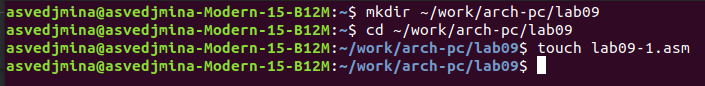{#fig:001 width=100%}

Ввожу в данный файл текст программы, использующую вызов подпрограммы.

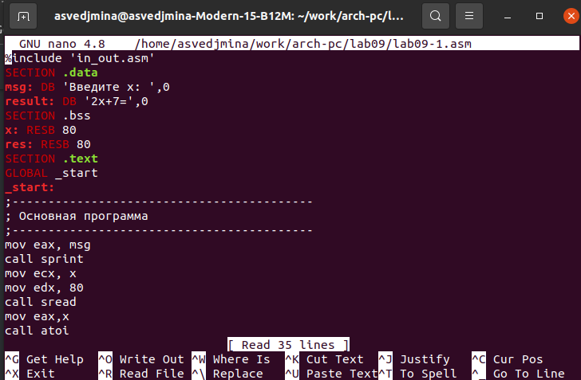{#fig:002 width=100%}

Создаю исполняемый файл и запускаю его.

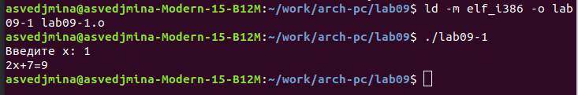{#fig:003 width=100%}

Затем изменяю текст программы, добавив подпрограмму _subcalcul в подпрограмму _calcul, чтобы _subcalcul вычисляла выражение 3*х-1.

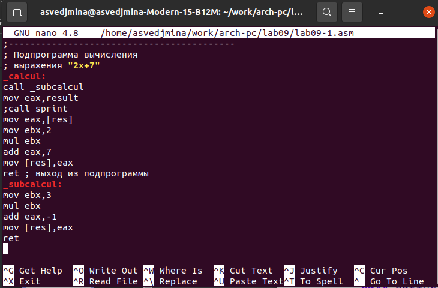{#fig:004 width=100%}

Создаю исполняемый файл и запускаю его.

{#fig:005 width=100%}

Создаю файл lab09-2.asm, ввожу в него текст программы с выводом сообщения Hello world!

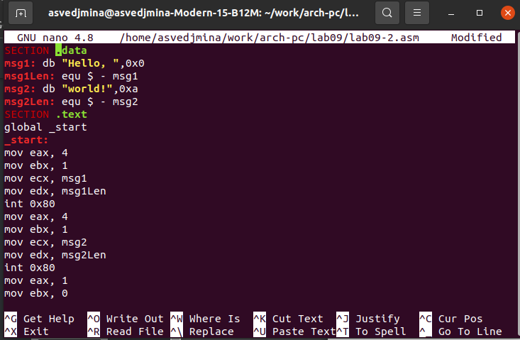{#fig:006 width=100%}

Получаю исполняемый файл, необходимый для работы с gdb, и загружаю его в отладчик.

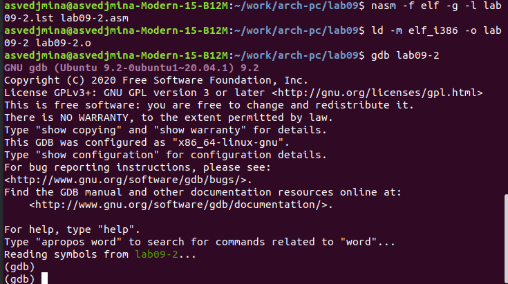{#fig:007 width=100%}

Запускаю программу в отладчике.

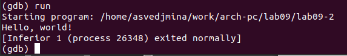{#fig:008 width=100%}

Устанавливаю брейкпоинт на метку _start, после чего вновь запускаю программу.

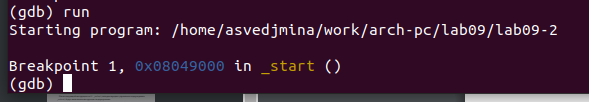{#fig:009 width=100%}

Открываю дисассимилированный код программы с помощью команды disassemble, начиная с метки _start, а затем переключаюсь на отображение с Intel’овским синтаксисом. В машинном коде используются $ и % для отображения регистров.

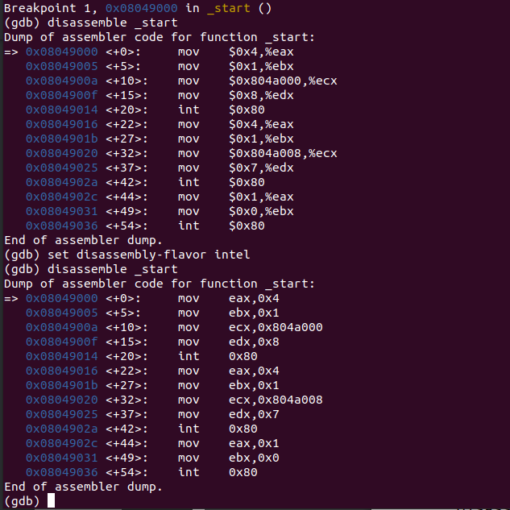{#fig:010 width=100%}

Далее включаю режим псевдографики.

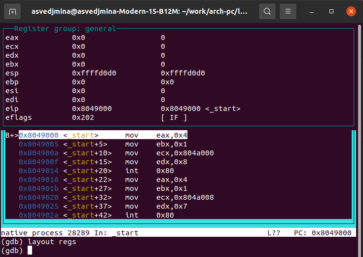{#fig:011 width=100%}

Вывожу информацию о всех точках останова.

{#fig:012 width=100%}

Устанавливаю вторую точку останова по адресу предпоследней инструкции.

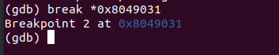{#fig:013 width=100%}

С помощью команды info registers, вывожу текущие значения регистров.

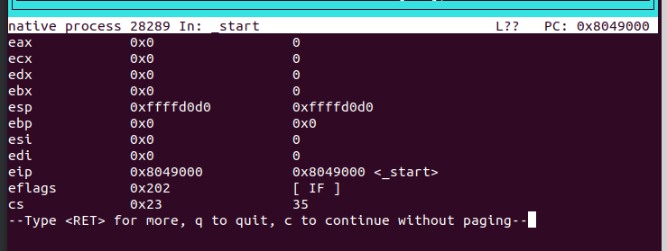{#fig:014 width=100%}

Затем смотрю значение переменной msg1.

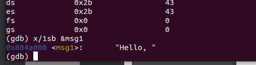{#fig:015 width=100%}

Смотрю значение переменной msg2.

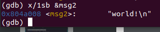{#fig:016 width=100%}

Изменяю первый символ переменной msg1 с помощью команды set.

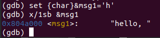{#fig:017 width=100%}

Заменяю также символ и в переменной msg2.

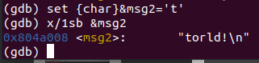{#fig:018 width=100%}

Вывожу значение регистра eax в шестнадцатеричном формате, в двоичном формате и
в символьном виде.

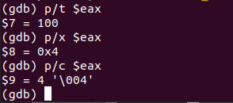{#fig:019 width=100%}

С помощью команды set изменяю значние регистра ebx.

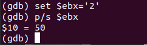{#fig:020 width=100%}

Вновь изеняю значение этого регистра.

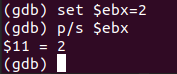{#fig:021 width=100%}

Разница в том, что в первый раз я записала в ebx символ, а во второй раз - число.

Завершаю выполнение программы с помощью команды continue и выхожу из gdb, используя команду quit. После этого копирую файл lab8-2.asm в lab09-3.asm.

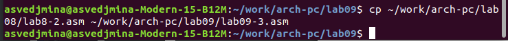{#fig:022 width=100%}

Создаю исполяемый файл.

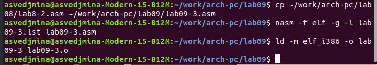{#fig:023 width=100%}

Передаю файл в gdb с тремя аргументами.

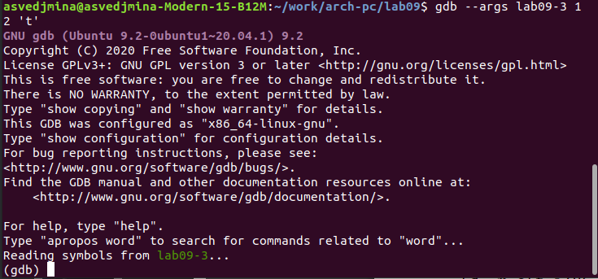{#fig:024 width=100%}

Ставлю точку останова перед первой инструкцией и запускаю программу.

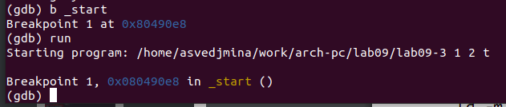{#fig:025 width=100%}

По адресу вершины стека узнаю количество аргументов, переданное программе (включая имя программы).

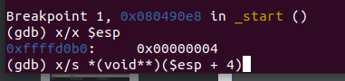{#fig:026 width=100%}

Затем смотрю отдельные позиции стека.

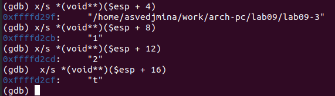{#fig:027 width=100%}

Шаг адреса равен 4, так как размер переменных составляет 4 байта.

#Выполнение заданий для самостоятельной работы

1. Преобразуйте программу из лабораторной работы №8 (Задание №1 для самостоятельной работы), реализовав вычисление значения функции 𝑓(𝑥) как подпрограмму.

Для выполнение задания создаю файл sumrub-1.asm, копирую в него текст программы из файла c заданием 1 из 8 лабораторной работы. После этого реализую вычисление функции как подпрограмму.

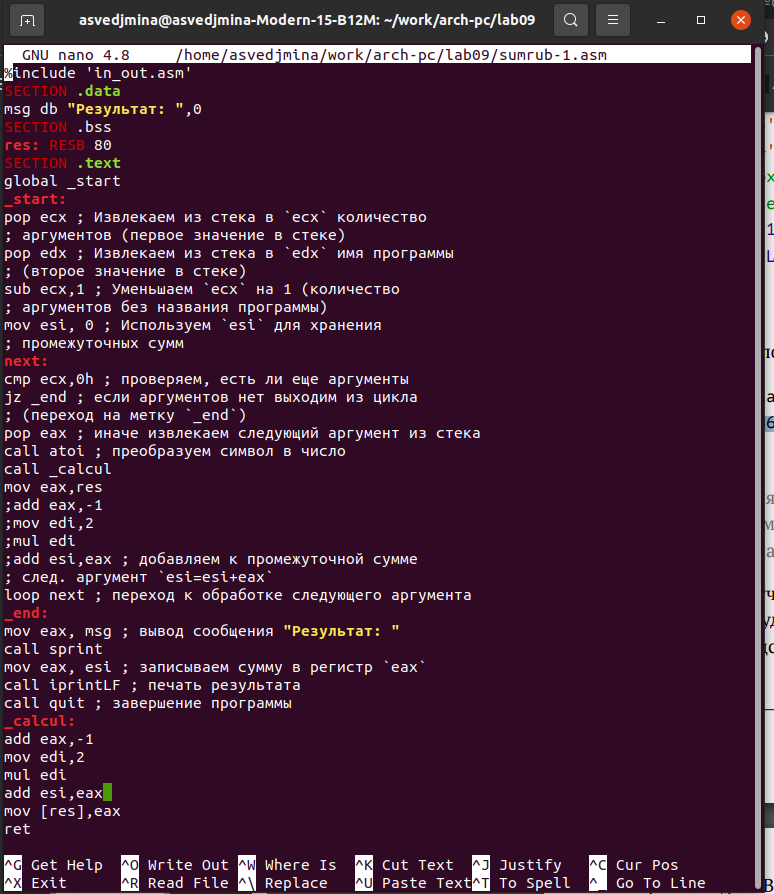{#fig:028 width=100%}

Создаю исполняемый файл и запускаю его.

{#fig:029 width=100%}

2. В листинге 9.3 приведена программа вычисления выражения (3 + 2) ∗ 4 + 5. При запуске
данная программа дает неверный результат. Проверьте это. С помощью отладчика GDB,
анализируя изменения значений регистров, определите ошибку и исправьте ее.

Для выполнения задания создаю файл sumrub-2.asm. Затем с поомощью gdb изучаю значения регистров.

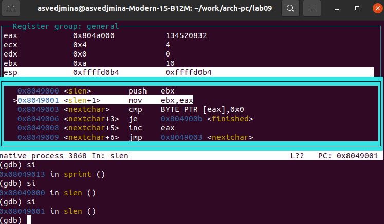{#fig:030 width=100%}

Узнаю, что в тексте программы регистры перепутаны местами и исправляю ошибку.

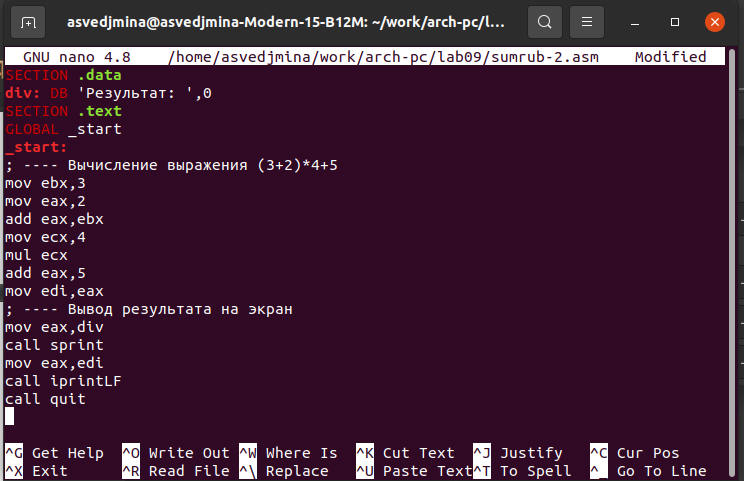{#fig:031 width=100%}

Для проверки создаю исполняемый файл и запускаю его.

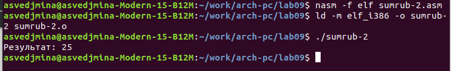{#fig:032 width=100%}

# Выводы

В ходе лабораторной работы я научилась использовать подпрограммы и работать с gdb.
