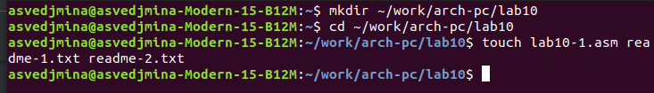
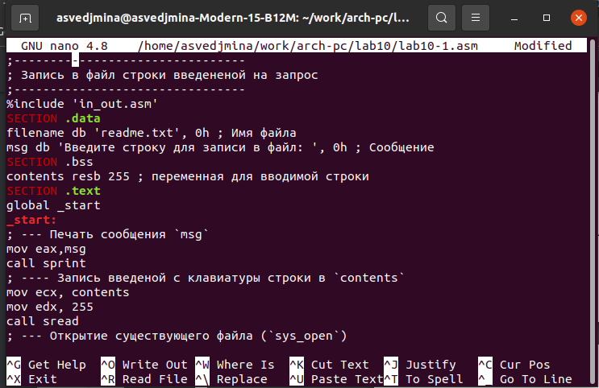
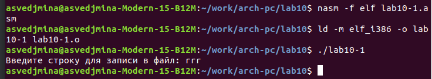
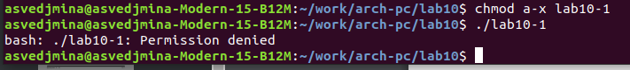
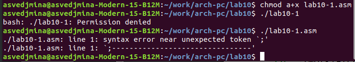
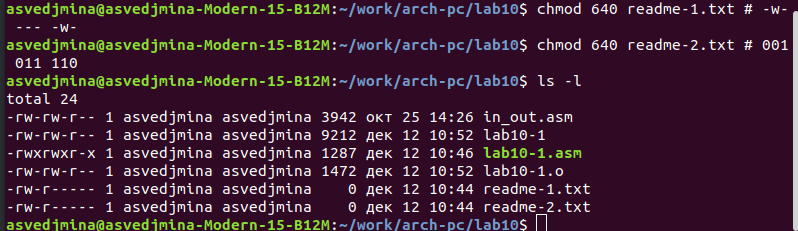
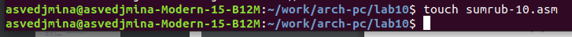
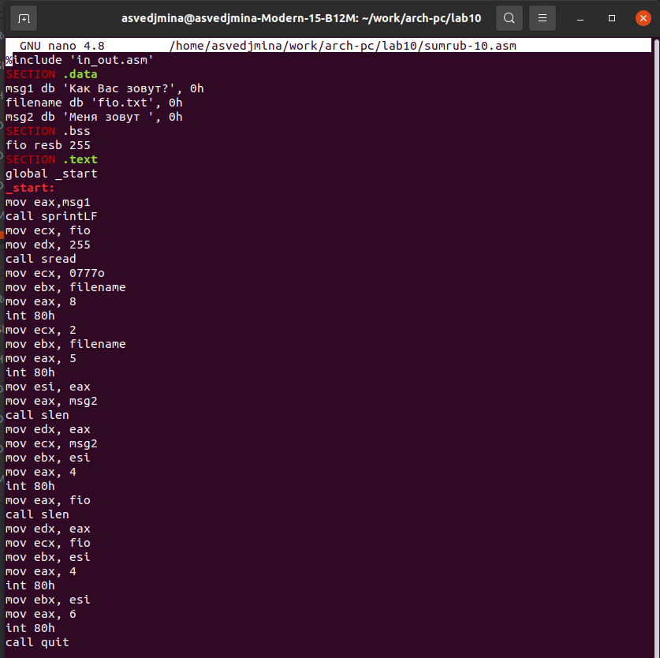
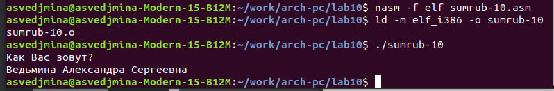
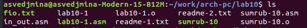

---
## Front matter
title: "Отчёт по лабораторной работе №10"
subtitle: "дисциплина: Архитектура компьютеров"
author: "Ведьмина Александра Сергеевна"

## Generic otions
lang: ru-RU
toc-title: "Содержание"

## Bibliography
bibliography: bib/cite.bib
csl: pandoc/csl/gost-r-7-0-5-2008-numeric.csl

## Pdf output format
toc: true # Table of contents
toc-depth: 2
lof: true # List of figures
lot: true # List of tables
fontsize: 12pt
linestretch: 1.5
papersize: a4
documentclass: scrreprt
## I18n polyglossia
polyglossia-lang:
  name: russian
  options:
	- spelling=modern
	- babelshorthands=true
polyglossia-otherlangs:
  name: english
## I18n babel
babel-lang: russian
babel-otherlangs: english
## Fonts
mainfont: PT Serif
romanfont: PT Serif
sansfont: PT Sans
monofont: PT Mono
mainfontoptions: Ligatures=TeX
romanfontoptions: Ligatures=TeX
sansfontoptions: Ligatures=TeX,Scale=MatchLowercase
monofontoptions: Scale=MatchLowercase,Scale=0.9
## Biblatex
biblatex: true
biblio-style: "gost-numeric"
biblatexoptions:
  - parentracker=true
  - backend=biber
  - hyperref=auto
  - language=auto
  - autolang=other*
  - citestyle=gost-numeric
## Pandoc-crossref LaTeX customization
figureTitle: "Рис."
tableTitle: "Таблица"
listingTitle: "Листинг"
lofTitle: "Список иллюстраций"
lotTitle: "Список таблиц"
lolTitle: "Листинги"
## Misc options
indent: true
header-includes:
  - \usepackage{indentfirst}
  - \usepackage{float} # keep figures where there are in the text
  - \floatplacement{figure}{H} # keep figures where there are in the text
---

# Цель работы

Приобретение навыков написания программ для работы с файлами средствами NASM.

# Задание

1. Ознакомиться с теоретическим введением.
2. Изучить функции команды chmod.
3. Выполненить задание для самостоятельной работы.

# Теоретическое введение

Права доступа определяют набор действий (чтение, запись, выполнение), разрешённых
для выполнения пользователям системы над файлами. Набор прав доступа задается тройками битов и состоит из прав на чтение, запись и исполнение файла. В символьном представлении он имеет вид строк rwx, где вместо любого символа может стоять дефис. Всего возможно 8 комбинаций. Свойства (атрибуты) файлов и каталогов можно вывести на терминал с помощью команды ls с ключом -l. В символьном представлении есть возможность явно указывать какой группе какие праванеобходимо добавить, отнять или присвоить. Для записи в файл служит системный вызов sys_write. Для чтения данных из файла служит системный вызов sys__read, который использует
следующие аргументы: количество байтов для чтения в регистре EDX, адрес в памяти длязаписи прочитанных данных в ECX, файловый дескриптор в EBX и номер системного вызоваsys_read (3) в EAX. Как и для записи, прежде чем читать из файла, его необходимо открыть, что позволит получить дескриптор файла.

# Выполнение лабораторной работы

Создаю каталог lab10, перехожу в него и создаю файлы lab10-1.asm, readme-1.txt и readme-2.txt.

{#fig:001 width=100%}

Ввожу в файл lab10-1.asm текст приграммы записи сообщения в файл.

{#fig:002 width=100%}

Создаю исполняемый файл и запускаю его.

{#fig:003 width=100%}

Затем с помощью команды chmod изменяю права доступа к файлу lab10-1, запрещая его выполнение.

{#fig:003 width=100%}

Выполняю этот файл. Выводится сообщение, что доступ к нему запрещён. Значит, всё выполнено правильно.

{#fig:004 width=100%}

Далее с помощью chmod изменяю права доступа к файлу lab10-1.asm, добавляя права на исполнение. Программа всё ещё не может быть запущена, так как запуск исполняемого файла запрещён.

{#fig:005 width=100%}

Номер моего варианта - 4. Предоставляю права доступа -w- --- -w- к файлу reedme-1.txt и 001 011 110 к файлу readme-2.txt.

{#fig:006 width=100%}

# Выполнение заданий для самостоятельной работы

Для выполнения задания создаю файл sumrub-10.asm.

{#fig:007 width=100%}

Ввожу в него текст программы, работающей по алгоритму:

• Вывод приглашения “Как Вас зовут?”
• ввести с клавиатуры свои фамилию и имя
• создать файл с именем name.txt
• записать в файл сообщение “Меня зовут”
• дописать в файл строку введенную с клавиатуры
• закрыть файл

{#fig:008 width=100%}

Создаю исполняемый файл и запускаю его.

{#fig:009 width=100%}

Проверяю наличие файлов с помощью команды ls.

{#fig:010 width=100%}

# Выводы

В ходе лабораторной работы я научилась писать программы для работы с файлами средствами NASM.
